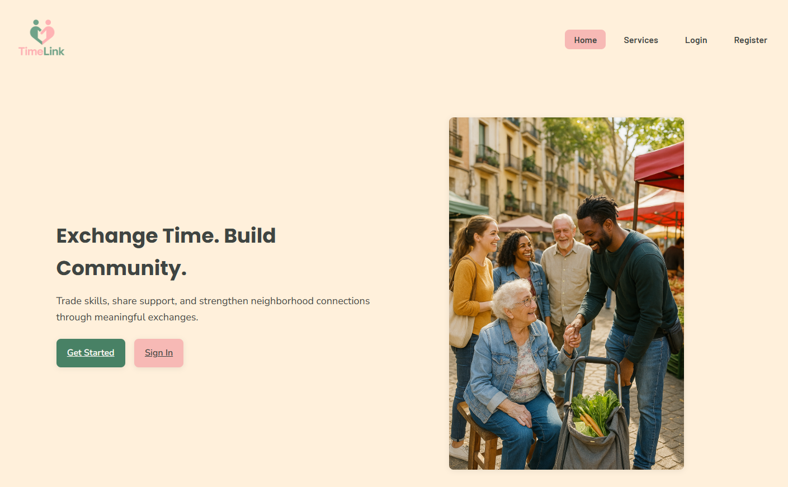
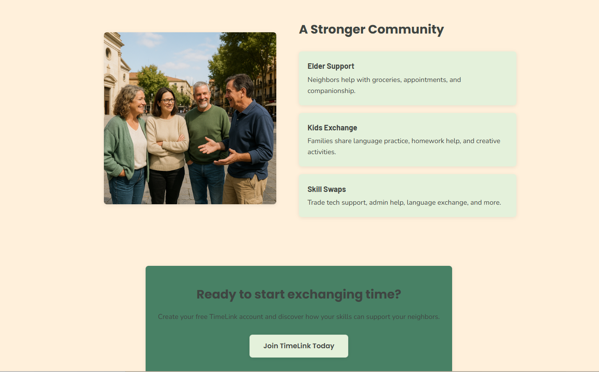
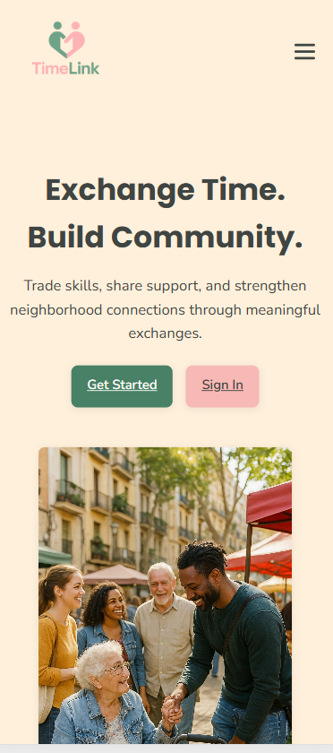

# TimeLink – Frontend  
**Building Stronger Communities Through Skill Sharing**

TimeLink is a community-driven platform that facilitates time-based exchanges between neighbors. Instead of money, users trade hours of service: tutoring, caregiving, tech support, gardening, and much more. This repository contains the **React-based frontend**, designed to provide an intuitive and accessible user experience across devices.

---

## Project Overview

The platform enables users to:

- Register and manage their profile  
- Browse and request services  
- Exchange time credits  
- Track given and received hours  
- Interact through a clean, responsive UI  
- Enjoy a seamless, mobile-first design  

This frontend communicates with a Spring Boot backend through a REST API.

---

## Architecture

**Frontend Architecture (React + Vite)**  
- Modularized component structure  
- Layout components for reusable UI sections (Header, Footer, CTA blocks)  
- `/pages` folder for main screens  
- `/context` folder with global authentication and toast providers  
- `/api` service layer for backend communication  
- SCSS with a centralized design system (`variables.scss`)  
- Mobile-first responsive design  
- State persistence via `localStorage` for authentication  

**High-Level Flow**  
```
User → React Router → Page View → Fetch API → Backend  
       ↑ Context Providers (Auth, Toast)
```

---

## Future Testing Strategy

Planned tests include:

- Unit tests (Vitest) for components and hooks  
- Integration tests for Auth flow  
- E2E tests (Playwright) for full UX paths  

---

## Tech Stack & Versions

| Technology | Version | Purpose |
|-----------|---------|---------|
| React | 19 | UI Library |
| Vite | 5 | Development tooling |
| React Router DOM | 7 | Routing |
| Sass (SCSS) | 1.77+ | Styling |
| Node.js | 20+ | Runtime |
| Toast Context (custom) | — | Reusable notification system |
| Auth Context (custom) | — | Global authentication state |

---

## Project Structure

```
timelink-frontend
├── .git
├── .gitignore
├── README.md
├── eslint.config.js
├── index.html
├── node_modules
├── package-lock.json
├── package.json
├── public
│   └── TimeLinkLogo.ico
├── src
│   ├── App.jsx
│   ├── api
│   │   ├── ApiAuth.js
│   │   ├── ApiCategory.js
│   │   ├── ApiService.js
│   │   └── ApiUser.js
│   ├── assets
│   │   ├── icons
│   │   │   ├── bluesky.png
│   │   │   ├── facebook.png
│   │   │   └── instagram.png
│   │   ├── images
│   │   │   ├── Vecinos-conversando.png
│   │   │   ├── home-community2.png
│   │   │   ├── home-hero.jpg
│   │   │   ├── preview-landing.png
│   │   │   ├── previewCTA.png
│   │   │   └── responsive-view.png
│   │   └── logo
│   │       └── TimeLinkLogo.png
│   ├── components
│   │   ├── common
│   │   ├── layout
│   │   │   ├── Footer.jsx
│   │   │   ├── Footer.scss
│   │   │   ├── Header.jsx
│   │   │   └── Header.scss
│   │   └── ui
│   │       ├── CommunitySection.jsx
│   │       ├── CommunitySection.scss
│   │       ├── FinalCTA.jsx
│   │       ├── FinalCTA.scss
│   │       ├── HeroSection.jsx
│   │       ├── HeroSection.scss
│   │       ├── HowItWorks.jsx
│   │       ├── HowItWorks.scss
│   │       └── toast
│   │           ├── Toast.jsx
│   │           └── Toast.scss
│   ├── context
│   │   ├── AuthContext.jsx
│   │   └── ToastContext.jsx
│   ├── main.jsx
│   ├── pages
│   │   ├── Home
│   │   │   └── Home.jsx
│   │   ├── Login
│   │   │   ├── Login.jsx
│   │   │   └── Login.scss
│   │   ├── Profile
│   │   │   └── Profile.jsx
│   │   ├── Register
│   │   │   ├── Register.jsx
│   │   │   └── Register.scss
│   │   └── Services
│   │       └── Services.jsx
│   ├── routes
│   │   └── AppRouter.jsx
│   └── styles
│       ├── _global.scss
│       ├── _mixins.scss
│       ├── _variables.scss
│       └── main.scss
└── vite.config.js
```

---

## Screenshots

### Landing Page


### Call to Action


### Responsive Mobile View


---

## Getting Started

### 1. Clone the repository
```bash
git clone https://github.com/YOUR-USERNAME/timelink-frontend.git
cd timelink-frontend
```

### 2. Install dependencies
```bash
npm install
```

### 3. Run development server
```bash
npm run dev
```

### 4. Environment variables
Create a `.env` file:
```
VITE_API_BASE=http://localhost:8080
```

---

## Security Notes (Frontend)

Although security is primarily backend-driven, the frontend implements:

- JWT persistence only in memory/localStorage  
- Logout that removes all sensitive data  
- Controlled error messaging  
- Defensive API handling  

---

## About me

I am a multilingual (ES / EN / IT) full-stack junior developer with solid adaptability, strong communication skills, and hands-on experience in:

- Modern frontend development with **React**
- Backend architecture using **Java / Spring Boot**
- Cloud fundamentals through **AWS re/Start**
- Agile teamwork (**Scrum**, **Kanban**)
- Writing clear technical documentation and supporting collaborative workflows

I bring reliability, stability, empathy, and a strong commitment to learning and delivering high-quality solutions in dynamic technical environments.

**LinkedIn:** [LinkedIn](https://www.linkedin.com/in/erikamontoya/)  
**GitHub:** [GitHub](https://github.com/DevErika)

---

## License
This project is part of the Full-Stack Developer Program at Factoría F5.
